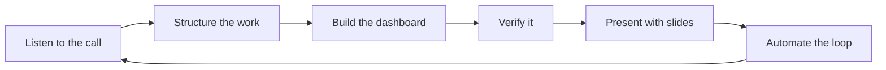
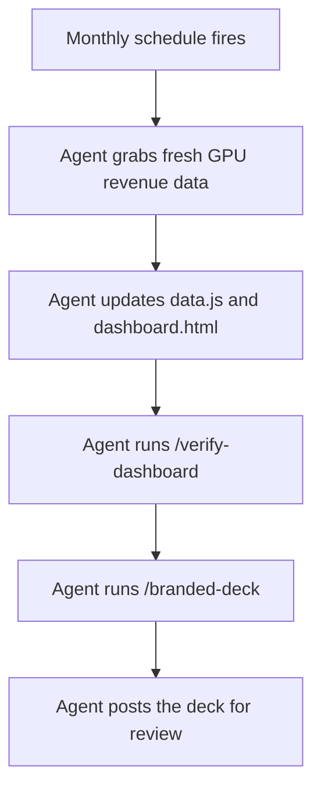

# Cursor for Everyone: Follow Along

Turn a messy leadership call into a working dashboard **and** a board-ready slide deck. No coding background needed.



**The loop:** listen → structure → build → verify → present → automate. Today you do it once by hand. By the end, you'll see how to make it repeat on its own.

---

## Your role today

For the next hour, you're on the team that owns a company's internal **revenue dashboard**. A leadership call just landed a familiar ask in your lap.

| | |
|---|---|
| **Your goal** | Ship a dashboard feature and a board-ready slide deck |
| **Why it matters** | This is everyday work: turning vague requests into real results |

---

## Get set up (about 5 minutes)

### 1. Install Cursor and sign in

Download Cursor from [cursor.com](https://cursor.com) if you haven't already. Open it and sign in.

### 2. Get the workshop folder

No GitHub account, no Git, no command line. Pick whichever feels easier.

**Option A (recommended): let Cursor's Agent grab it for you**

1. In Cursor, open a new chat (the Agent panel, usually on the right).
2. Paste this and hit send:

   ```
   Download this workshop and open it for me, no git needed. Use curl to fetch the ZIP,
   unzip it into my home folder, then open the unzipped folder:
   https://github.com/hsaab/cursor-for-everyone-workshop/archive/refs/heads/main.zip
   ```

3. When Cursor asks to run a command, click **Run**. It downloads the files, unzips them, and opens the folder.

That is the whole point of Cursor: you ask in plain English and the agent does the work. You just did your first one.

**Option B: download it yourself (3 clicks)**

1. Open [the workshop on GitHub](https://github.com/hsaab/cursor-for-everyone-workshop).
2. Click the green **Code** button, then **Download ZIP**.
3. Unzip it. In Cursor, choose **File → Open Folder** and pick the unzipped folder.

> **What is GitHub?** It's where this project lives online, like a shared drive for a project's files. This repo is public, so anyone can grab it.

> **Stuck on any step?** Paste what you see (or any error) into the Cursor chat and ask it to help. That trick works for the rest of the workshop too.

### 3. Open the dashboard

Double-click **`dashboard.html`** in the project folder. It opens in your browser.

Notice the **"Revenue by GPU type"** card is empty. That's what we're going to fix.

> **Tip:** In chat, type `@` to point Cursor at a specific file (for example `@transcript.md`).

---

## Connected tools are optional

Cursor can connect to tools you already use (Figma, Slack, Linear, and more) through **[MCP](https://cursor.com/docs/mcp)** servers and **[Plugins](https://cursor.com/docs/plugins)**. For today, **everything you need is already in this folder.** No extra accounts or setup.

| What you need | In this repo | Optional live version |
|---|---|---|
| Call notes | `transcript.md` | Granola MCP |
| Design | `design/` folder | Figma MCP |
| Data | `data/revenue_by_gpu_type.csv` | Database MCP |

Your host may demo the live versions on screen. You can try them later if you connect those tools. The repo always works on its own.

---

## 📖 Step 1 · Understand the story

Before touching anything, read the call notes.

Open **`transcript.md`** in Cursor (click it in the left sidebar).

**What's happening?**

- Leadership loves the topline revenue number (~$415M in June).
- But every review, someone asks: **"Which GPU types drive the revenue?"**
- The dashboard only shows totals and regional splits. Casey is manually building charts in spreadsheets every month.
- Riley wants to see the **mix shift over 6 months** (A100 tapering off, GB200 / Blackwell ramping up).
- Jordan needs **branded slides for the board** by Thursday.

**The data already exists** in `data/revenue_by_gpu_type.csv`. It just isn't in the dashboard yet.

That's your job today.

---

## 🔍 Step 2 · Understand what we're working with

### The project files

| File / folder | What it is |
|---|---|
| `dashboard.html` | The dashboard page (opens in your browser) |
| `dashboard.js` | Logic that draws the charts |
| `data.js` | The numbers baked into the page |
| `styles.css` | Colors and layout |
| `data/` | Raw data files (CSV spreadsheets) |
| `design/` | Design specs, colors, and mockups |
| `.cursor/rules/` | Standing instructions Cursor always follows |

Take a minute to click through these in the sidebar. You don't need to understand the code. Just know where things live.

### See the dashboard now

Open **`dashboard.html`** in your browser if it's not already open. Scroll through it. Notice what's there (totals, regional split, revenue trend) and what's missing (GPU breakdown).

### Pick the right model

Cursor lets you choose which AI model powers your chat. Different models are good at different things.

| Task | Model to use | Why |
|---|---|---|
| Planning, reasoning, reading messy docs | **Opus** (or similar reasoning model) | Better at understanding ambiguity and tradeoffs |
| Writing and editing code | **Composer 2.5** | Fast, cost-efficient, built for coding tasks |
| Quick questions about files | Any model works | Ask mode is read-only anyway |

> **Cost tip:** Opus is great for planning but can cost roughly **10x more** than Composer 2.5 for similar implementation work. A good pattern: **plan with Opus, build with Composer 2.5.**

Learn more: [Models and pricing](https://cursor.com/docs/models-and-pricing)

### Know your modes

Cursor has four chat modes. Press **Shift + Tab** to switch between them, or use the dropdown in the chat panel.

| Mode | Best for | Can edit files? |
|---|---|---|
| **Agent** | Building features, making changes | Yes |
| **Plan** | Complex work where you want to review the approach first | Yes (after you approve) |
| **Ask** | Understanding code, exploring without changes | No (read-only) |
| **Debug** | Tricky bugs that need investigation | Yes |

Learn more: [Agent overview](https://cursor.com/docs/agent/overview)

---

## 📋 Step 3 · Turn the messy call into a spec (Plan mode)

Now let's structure the work before building anything.

1. Switch to **Plan** mode (Shift + Tab until you see "Plan").
2. Select a **reasoning model** like Opus for this step.
3. Paste this prompt:

```
@transcript.md Read this internal revenue review call and list exactly what
they're asking for as a short, concrete spec. Group it into "dashboard changes"
and "slides". Keep it to bullet points.
```

Cursor will read the transcript, ask clarifying questions if needed, and produce a structured plan you can review and edit before any code gets written.

That's the power of [Plan mode](https://cursor.com/docs/agent/plan-mode): think first, build second.

---

## 🎨 Step 4 · Iterate on the plan

Your plan is a draft. Now make it sharper by adding the design and teaching Cursor your preferences.

### Add the design

Tell Cursor about the mockup so the build matches what the designer intended. In the same Plan chat (or a new one), paste:

```
@design/gpu-section-spec.md @design/design-tokens.json @design/revenue-by-gpu-type.png
Review the plan and update it to include building this GPU section to match
this design spec and these color tokens.
```

### Set house rules with Rules

**[Rules](https://cursor.com/docs/rules)** are standing instructions Cursor follows automatically. You write them once, and every future chat benefits.

This repo already has two in `.cursor/rules/`:

| Rule | What it does |
|---|---|
| `cursor-brand.mdc` | Cursor colors and clean visual style (why the dashboard and slides stay on-brand) |
| `dashboard-html.mdc` | How to format the dashboard's HTML and CSS |

Open one in the sidebar. They're short.

Now create your own. Type **`/create-rule`** in chat and describe what Cursor should always do:

```
/create-rule Every chart on the dashboard needs labeled axes and a one-line
"so what?" caption underneath. Apply it to *.html.
```

Cursor saves it to `.cursor/rules/` and follows it from then on.

---

## 🚀 Step 5 · Build it (Agent mode)

Time to ship. Switch to **Agent** mode and select **Composer 2.5**.

Paste this prompt:

```
@data/revenue_by_gpu_type.csv @design/gpu-section-spec.md @design/design-tokens.json @dashboard.js @data.js @styles.css
Add a "Revenue by GPU type" section to the dashboard using this CSV, matching the
design spec and tokens. Read the CSV and inline the data into the app (do NOT fetch
it at runtime, since the page is opened directly from a file). Show revenue by GPU
type for the latest month, plus a 6-month trend that makes the mix shift obvious.
Use the GPU-type colors from the tokens. Call out the fastest-growing GPU type and
flag where GB200 overtakes A100.
```

### What happens when you hit send

The [Agent](https://cursor.com/docs/agent/overview) will:

1. **Read** the files you tagged with `@`
2. **Search** the codebase for patterns to follow
3. **Edit** multiple files (data, HTML, CSS, JavaScript)
4. **Show you** what changed so you can review

You don't write code. You describe what you want, point at the right files, and the agent figures out the rest.

---

## ✅ Step 6 · Verify the dashboard (your first Skill)

Two ways to check your work: let a skill do it, then trust your own eyes.

### Run a ready-made Skill

**[Skills](https://cursor.com/docs/skills)** are reusable workflows you run by name, like saved recipes. Describe the steps once, and anyone can trigger them with a slash command.

This repo ships one for exactly this moment: **`/verify-dashboard`**. It reads your files and checks the new section against the workshop's acceptance criteria. Type it in chat:

```
/verify-dashboard
```

It reports a short pass/fail list: is the card there? does June total $415M? is the GB200-over-A100 crossover shown? is the data inlined instead of fetched? If anything failed, paste the suggested fix and run it again.

### Look with your own eyes

Go back to your browser and **refresh** `dashboard.html`. Check the **"Revenue by GPU type"** card:

- Latest month breakdown by GPU type
- 6-month trend showing the mix shift
- GB200 highlighted as the fastest grower
- The moment GB200 overtakes A100 called out

You just shipped a feature, and verified it two ways.

**If you're ahead, try one of these follow-ups in Agent mode:**

```
Change the GPU-type chart to a stacked view so I can see the mix each month.
```

```
Recolor the chart so GB200 stands out and the legacy A100 is muted.
```

Play around. This is your dashboard now.

---

## 📊 Step 7 · Make your own Skill (and your slides)

You just *ran* a skill. Now *build* one. First, knock out the deck you owe leadership with a second ready-made skill.

### Run the slides Skill

This repo also ships **`/branded-deck`**. It reads your dashboard, pulls the real numbers, applies the brand rule, and generates a polished `.pptx`. No Slack, Linear, Notion, or internal tools needed, just the files in this repo.

Type **`/branded-deck`** in chat and paste:

```
/branded-deck Summarize this for leadership: headline revenue, revenue by GPU
type, the 6-month mix shift toward GB200, and 3 takeaways. Read the numbers from
@dashboard.html and @data/revenue_by_gpu_type.csv.
```

Behind the scenes it:

1. Follows `.cursor/rules/cursor-brand.mdc` for on-brand styling
2. Reads the built dashboard and CSV for real numbers
3. Uses the built-in slide generator to produce the `.pptx`

### Now create your own

You've run two skills (`/verify-dashboard` and `/branded-deck`). Making your own is just as easy. Type **`/create-skill`** and describe a workflow you repeat, for example:

```
/create-skill A "monthly-refresh" skill that re-reads data/revenue_by_gpu_type.csv,
updates the dashboard numbers, runs /verify-dashboard, then runs /branded-deck.
```

Cursor saves it under `.cursor/skills/` so you and your teammates can run it by name from then on.

---

## ⚡ Step 8 · Automate the whole loop (high level)

Everything you did today was manual: you pasted prompts, reviewed plans, and refreshed the browser. What if it happened automatically every month?

**[Cursor Automations](https://cursor.com/docs/cloud-agent/automations)** are always-on cloud agents. You set a trigger (like a schedule), write instructions, and Cursor runs the job in the background without you in the IDE.

Here's what a monthly version of today's work could look like:



| Step | What the automation does |
|---|---|
| **Trigger** | Runs on the 1st of every month (cron schedule) |
| **Fetch data** | Pulls the latest revenue-by-GPU export (from a CSV, database, or API) |
| **Update dashboard** | Inlines the new numbers into `data.js` and refreshes the charts |
| **Verify** | Runs `/verify-dashboard` to catch data or rendering issues before slides |
| **Generate slides** | Runs the `/branded-deck` skill with the updated dashboard |
| **Notify** | Posts the new deck somewhere your team can review (email, Slack, or a shared folder) |

You wouldn't build this today. But now you know the shape: **the same loop you just did by hand, running on autopilot.**

Create one at [cursor.com/automations](https://cursor.com/automations) or in the Agents window when you're ready.

---

## 🎉 Step 9 · Review what we did

Take a breath. Look at what you built.

| Step | What you learned |
|---|---|
| 1. Story | Read messy input and understand the real ask |
| 2. Codebase | Know where files live and which model/mode to pick |
| 3. Plan | Turn a call transcript into a structured spec ([Plan mode](https://cursor.com/docs/agent/plan-mode)) |
| 4. Iterate | Add designs with `@`, set standing preferences with [Rules](https://cursor.com/docs/rules) |
| 5. Build | Ship a feature with [Agent mode](https://cursor.com/docs/agent/overview) + Composer 2.5 |
| 6. Verify | Run a ready-made [Skill](https://cursor.com/docs/skills) (`/verify-dashboard`), then eyeball it |
| 7. Present | Run the `/branded-deck` skill, then build your own with `/create-skill` |
| 8. Automate | See how the whole loop could run on a schedule ([Automations](https://cursor.com/docs/cloud-agent/automations)) |

**What Cursor learned from you:**

- A **rule** (your chart caption preference) that applies to every future chat
- A **skill** of your own, on top of the ready-made `/verify-dashboard` and `/branded-deck`, runnable by name anytime

**What you can do next:**

Swap in *your* call notes, *your* spreadsheet, *your* design files. The loop stays the same: listen → structure → build → verify → present → automate.

That's Cursor for everyone.
