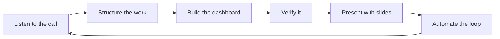
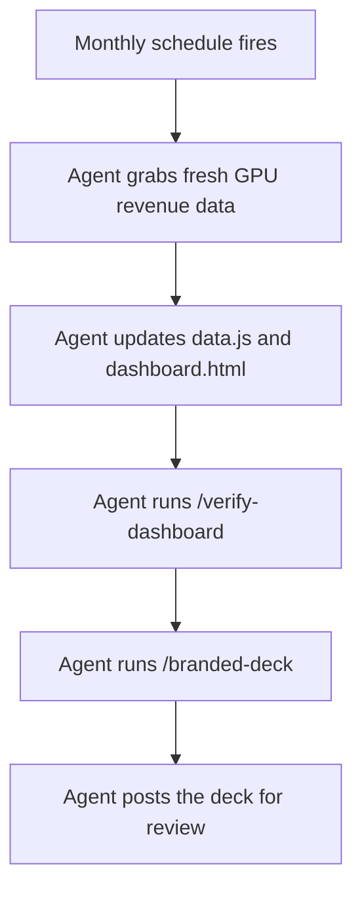

# Cursor for Everyone: Follow Along

Turn a messy leadership call into a working dashboard **and** a board-ready slide deck. No coding background needed.




**The loop:** listen, structure, build, verify, present, automate. Today you do it once by hand. By the end, you will see how to make it repeat on its own.

**Your role:** for the next hour you are on the team that owns a company's internal **revenue dashboard**. A leadership call just landed a familiar ask in your lap: ship a dashboard feature and a board-ready deck. This is everyday work, turning a vague request into a real result.

---

## Get set up (about 5 minutes)

**1. Install Cursor and sign in.** Download from [cursor.com](https://cursor.com), open it, and sign in.

**2. Get the workshop folder.** No GitHub account or command line required. Pick whichever is easier.

*Option A (recommended): let the Agent grab it.* Open a new chat (the panel on the right) and send:

```
Download this workshop and open it for me, no git needed. Use curl to fetch the ZIP,
unzip it into my home folder, then open the unzipped folder:
https://github.com/hsaab/cursor-for-everyone-workshop/archive/refs/heads/main.zip
```

When Cursor asks to run a command, click **Run**. That is the whole point of Cursor: you ask in plain English and the agent does the work.

*Option B: download it yourself.* Open [the repo on GitHub](https://github.com/hsaab/cursor-for-everyone-workshop), click the green **Code** button, then **Download ZIP**. Unzip it, then in Cursor choose **File**, then **Open Folder**, and pick the unzipped folder.

> **What is GitHub?** Where this project lives online, like a shared drive for a project's files. This repo is public, so anyone can grab it.
>
> **Stuck on anything?** Paste what you see (or any error) into the chat and ask Cursor to help. That trick works for the rest of the workshop too.

---

## Connected tools are optional

Cursor can connect to tools you already use (Figma, Slack, Linear, Granola, and more) through **[MCP](https://cursor.com/docs/mcp)** servers and **[Plugins](https://cursor.com/docs/plugins)**. For today, **everything you need is already in this folder.** No extra accounts.


| What you need | In this repo                   | Optional live version |
| ------------- | ------------------------------ | --------------------- |
| Call notes    | `transcript.md`                | Granola MCP           |
| Design        | `design/` folder               | Figma MCP             |
| Data          | `data/revenue_by_gpu_type.csv` | Database MCP          |


Your host may demo the live versions on screen. The repo always works on its own.

---

## Step 1 · Send your first prompt

Open a new chat with **Agent** mode selected, then ask something simple to get oriented:

```
I am doing a hands-on workshop in this project and I am not very technical.
In a few plain-English bullets: what is this project and what will I build today?
```

**Pick the right model.** Cursor lets you choose which AI model powers the chat, and different models are good at different things. Switch models from the dropdown in the chat box.


| Task                            | Model                        | Why                                  |
| ------------------------------- | ---------------------------- | ------------------------------------ |
| Planning, reasoning, messy docs | **Opus** (a reasoning model) | Better with ambiguity and tradeoffs  |
| Writing and editing code        | **Composer 2.5**             | Fast and cost-efficient for building |
| Quick questions                 | Any model                    | Light work, anything handles it      |


> **Cost tip:** Opus can cost roughly **10x more** than Composer 2.5 for similar build work. A good pattern: **plan with Opus, build with Composer 2.5.** See [Models and pricing](https://cursor.com/docs/models-and-pricing).

You also pick a **mode** (press **Shift + Tab** to switch): **Agent** builds and edits, **Plan** drafts an approach first, **Ask** is read-only for exploring, **Debug** chases tricky bugs. You will use all but Debug today. More in the [Agent docs](https://cursor.com/docs/agent/overview).

---

## Step 2 · Understand what is in the repo

Let the agent give you the tour instead of reading code yourself. **Ask** mode is perfect here: it is read-only, so nothing changes while you explore. Switch to Ask and send a few questions:

```
Give me a quick, non-technical tour of this folder. What are the main files,
what does each one do, and what is this dashboard for? Keep it to a short list.
```

```
What does data.js do, and where do the dashboard's numbers come from?
```

For reference, here is what lives where:


| File / folder    | What it is                                  |
| ---------------- | ------------------------------------------- |
| `dashboard.html` | The dashboard page (opens in your browser)  |
| `dashboard.js`   | Logic that draws the charts                 |
| `data.js`        | The numbers baked into the page             |
| `styles.css`     | Colors and layout                           |
| `data/`          | Raw data files (CSV spreadsheets)           |
| `design/`        | Design spec, colors, and mockup             |
| `.cursor/rules/` | Standing instructions Cursor always follows |


### See the dashboard in your browser

Pick the option that fits your setup.

*Option A (you have Python, typical on a Mac): let the agent serve it.* In Agent mode, send:

```
I have Python installed on my Mac. Start a simple local web server in this
folder and give me the localhost link to open dashboard.html in my browser.
```

Click **Run** when prompted, then open the link it gives you (something like `http://localhost:8000/dashboard.html`).

*Option B (no Python): open the file directly.* In Agent mode, send:

```
Reveal dashboard.html in Finder so I can double-click it to open in my browser.
```

Then double-click the file. (Or in the sidebar, right-click `dashboard.html`, choose Reveal in Finder, and double-click it.)

Either way, scroll through it. You will see the total, the regional split, and a revenue trend. Notice the **"Revenue by GPU type"** card is empty. That is what you will build.

---

## Step 3 · Understand the call

Before planning anything, get clear on what leadership actually asked for. The notes from the call are in `transcript.md`.

**A quick word on context and tokens.** Models read and write in **tokens**, small chunks of text (roughly pieces of words), and they work within a budget of them. Everything the model can see at once (your message, the files you attach, the chat so far) is its **context**. Attaching only what matters keeps that context focused, which makes answers faster, cheaper, and more accurate.

That is what `@` is for. Type `@` to hand the model a specific file instead of making it guess or read everything. Point it at the transcript:

```
@transcript.md This is an internal revenue review call. In a few bullets:
what happened, who is asking for what, and the one thing the dashboard is still missing?
```

Ask follow-ups until the ask is clear. For example:

```
@transcript.md What exactly does leadership want for the board on Thursday,
and which GPU types should the dashboard show?
```

Nothing on your computer changes yet, this is still just understanding. More on attaching context in the [prompting docs](https://cursor.com/docs/agent/prompting).

---

## Step 4a · Make a plan (Plan mode)

Now structure the work before any code gets written. Switch to **Plan** mode (Shift + Tab) and pick a reasoning model like **Opus**. Then send:

```
@transcript.md Turn this call into a short, concrete spec for what to build.
Group it into "dashboard changes" and "slides". Bullet points only.
```

Cursor reads the transcript, asks clarifying questions if needed, and produces a plan you can review and edit before building. That is the point of [Plan mode](https://cursor.com/docs/agent/plan-mode): think first, build second.

---

## Step 4b · Shape the plan around the design and include the data

Your plan is a draft. Make it match what the designer intended.

First, **open the design and look at it**: open `design/revenue-by-gpu-type.png` in Cursor to see the mockup, and skim `design/gpu-section-spec.md` for the details (layout, colors, the story to surface).

Then run one round of iteration to fold the design and data into the plan. In the same Plan chat, send:

```
@design/gpu-section-spec.md @design/design-tokens.json @design/gpu-section-mock.svg @data/revenue_by_gpu_type.csv
Update the plan to match this design and data: use the GPU-type color tokens, inline
the CSV with no runtime fetch, show the latest month plus a 6-month mix-shift trend,
and flag the fastest grower and where GB200 overtakes A100.
```

Review the updated plan and approve it. It now carries everything needed to build.

> **Optional:** the same design can be pulled live from Figma via the Figma MCP (usually a host demo). See `[design/README.md](./design/README.md)` for the local-plus-live pattern.

---

## Step 5 · Build it (Agent mode)

The plan already has the design, data, and details, so building is the easy part. Switch to **Agent** mode, select **Composer 2.5**, and send:

```
Build the approved plan.
```

The [Agent](https://cursor.com/docs/agent/overview) works through the plan: it reads the relevant files, edits the data, HTML, CSS, and JavaScript, and shows you each change to review. You approved the what; it handles the how.

---

## Step 6 · While it builds: write a rule

The build takes a minute, so let it run and **open a second chat** (the `+` at the top of the chat panel). Agents can work in parallel, so the first one keeps building while you do this.

**[Rules](https://cursor.com/docs/rules)** are standing instructions Cursor follows automatically. Write one once and every future chat benefits. This repo already has two in `.cursor/rules/`:


| Rule                 | What it does                               |
| -------------------- | ------------------------------------------ |
| `cursor-brand.mdc`   | Cursor colors and clean visual style       |
| `dashboard-html.mdc` | How to format the dashboard's HTML and CSS |


Open one, they are short. Now make your own with `/create-rule`:

```
/create-rule Every chart on the dashboard needs labeled axes and a one-line
"so what?" caption underneath. Apply it to *.html.
```

Cursor saves it to `.cursor/rules/` and follows it from then on. By now the build from Step 5 is probably done, so flip back and review what changed.

---

## Step 7 · Verify the dashboard (run a Skill)

**[Skills](https://cursor.com/docs/skills)** are reusable workflows you run by name, like saved recipes. This repo ships one for this exact moment. Run it:

```
/verify-dashboard
```

It reads your files and reports a short pass/fail list: is the card there? does June total $415M? is the GB200-over-A100 crossover shown? is the data inlined instead of fetched? If anything fails, paste the suggested fix and run it again.

Then **look with your own eyes**: refresh `dashboard.html` in your browser (or restart the server) and check the **"Revenue by GPU type"** card for the latest-month breakdown, the 6-month mix shift, GB200 as the fastest grower, and the moment GB200 overtakes A100.

**Ahead of the group?** Try a follow-up in Agent mode:

```
Change the GPU-type chart to a stacked view so I can see the mix each month.
```

---

## Step 8 · Make slides, then make your own Skill

First, knock out the deck you owe leadership with a second ready-made skill, `/branded-deck`:

```
/branded-deck Summarize this for leadership: headline revenue, revenue by GPU type,
the 6-month mix shift toward GB200, and 3 takeaways. Read the numbers from
@dashboard.html and @data/revenue_by_gpu_type.csv.
```

It follows the brand rule, reads the real numbers from your files, and generates a polished `.pptx`. No outside tools needed.

You have now run two skills. Building your own is just as easy, with `/create-skill`:

```
/create-skill A "monthly-refresh" skill that re-reads data/revenue_by_gpu_type.csv,
updates the dashboard numbers, runs /verify-dashboard, then runs /branded-deck.
```

Cursor saves it under `.cursor/skills/` so you and your teammates can run it by name anytime.

---

## Step 9 · Automate the whole loop

Everything so far was manual: you pasted prompts and refreshed the browser. What if it ran on its own every month?

**[Cursor Automations](https://cursor.com/docs/cloud-agent/automations)** are always-on cloud agents. You set a trigger (like a schedule), write instructions, and Cursor runs the job in the background without you in the IDE.




| Step                 | What the automation does                        |
| -------------------- | ----------------------------------------------- |
| **Trigger**          | Runs on the 1st of every month                  |
| **Fetch data**       | Pulls the latest revenue-by-GPU export          |
| **Update dashboard** | Inlines the new numbers and refreshes charts    |
| **Verify**           | Runs `/verify-dashboard` before slides          |
| **Generate slides**  | Runs `/branded-deck` with the updated dashboard |
| **Notify**           | Posts the deck somewhere your team can review   |


You would not build this today, but now you know the shape: the same loop you just did by hand, running on autopilot. Create one at [cursor.com/automations](https://cursor.com/automations) when you are ready.

---

## Step 10 · Review what you did


| Step            | What you learned                                                                                       |
| --------------- | ------------------------------------------------------------------------------------------------------ |
| 1. First prompt | Open a chat, pick a [model](https://cursor.com/docs/models-and-pricing) and mode, ask in plain English |
| 2. Repo tour    | Explore safely in Ask mode and run the dashboard locally                                               |
| 3. The call     | Use `@` and [context](https://cursor.com/docs/agent/prompting) to focus on what matters                |
| 4. Plan         | Turn the call into a spec, shaped by the design ([Plan mode](https://cursor.com/docs/agent/plan-mode)) |
| 5. Build        | Ship a feature with [Agent mode](https://cursor.com/docs/agent/overview) and Composer 2.5              |
| 6. Rules        | Set standing preferences with [Rules](https://cursor.com/docs/rules)                                   |
| 7. Verify       | Run a ready-made [Skill](https://cursor.com/docs/skills), then eyeball it                              |
| 8. Present      | Generate slides, then build your own skill                                                             |
| 9. Automate     | See the whole loop run on a schedule ([Automations](https://cursor.com/docs/cloud-agent/automations))  |


**What Cursor learned from you:** a **rule** (your chart-caption preference) that applies to every future chat, and a **skill** of your own, runnable by name anytime.

**What is next:** swap in *your* call notes, *your* spreadsheet, *your* design files. The loop stays the same: listen, structure, build, verify, present, automate.